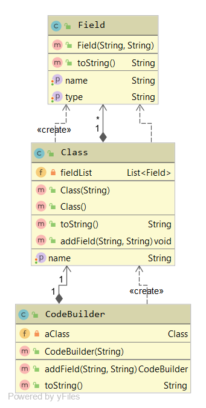
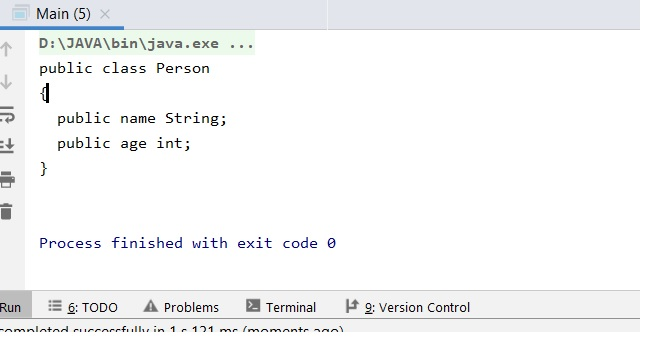

# Code_Builder

The code demonstrates the builder design pattern. 

Builder Design Pattern
This design pattern is helpful in creating objects in steps instead of at once. This comes in handy while creating large, complex object.
One of the examples of Builder Pattern in Java is StringBuilder.
We use Append method to build the complete string.
StringBuilder sb=new StringBuilder();
sb.append("Hello");
sb.append("World"");
Unlike String.concat(); append does not create a new object instead adds onto the previously created StringBuilder Object

Fig.Class Diagram for Code_Builder

##Brief overview of this code:
####Class CodeBuilder 
 It is used to build the code and it has the following Methods:
 + addField: This method works like a proxy and relays the fields to addField method of class "Class"
 + CodeBuild constructor which accepts the value of a class
####Class "Class"
 Used to Store the name of class and print the layout. Has the following functions:
 + addField: For adding field to our class. These fields are stored in a List called FieldList
 + toString(): We have overridden the toString() so it can form the code
####CLass Field
  Used to store the type and name of the field
  
##OUTPUT
        public static void main(String[] args) {
            CodeBuilder codeBuilder=new CodeBuilder("Person").addField("name","String").addField("age","int");
            System.out.println(codeBuilder);
        }
 The above code is used to build the class Person with fields name and age of type String and int respectively.
 The output is :
 
   

